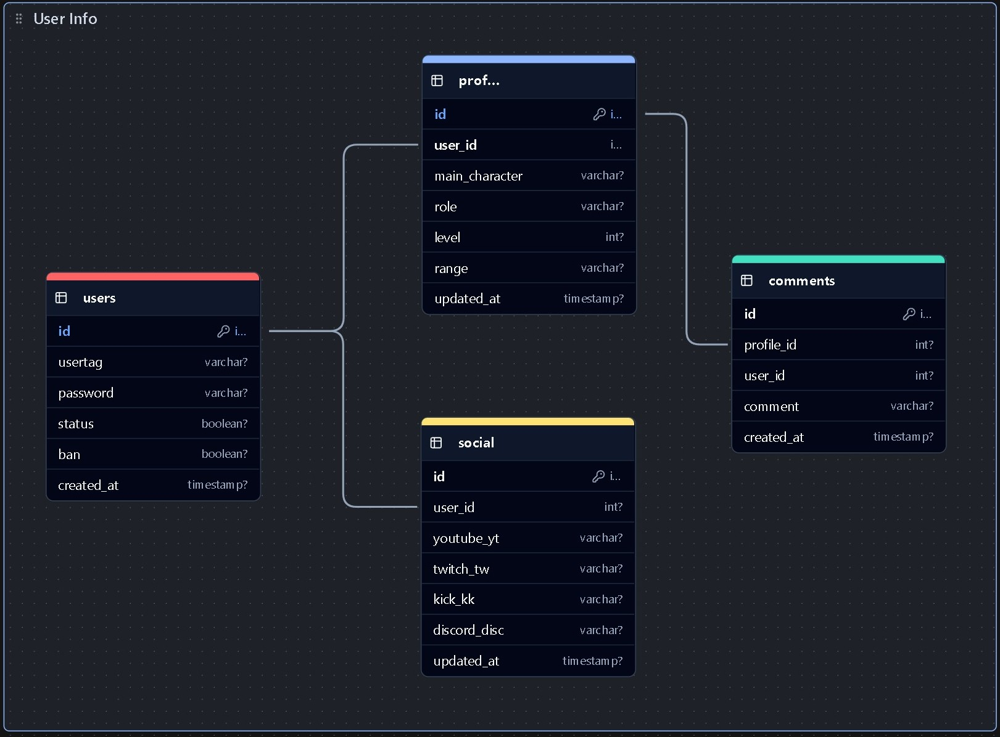

# VESTAgame - APP
- This is a web application for gamers that allows users to create a profile using their in-game information from video games such as Overwatch and Marvel Rivals (In this case we will start only with Marvel Rivals and then implement other games in future updates).

## MODULES DOCUMENTATION

- **```AUTH MODULE```**
    - The user will be able to SignUp with his **Usertag** of the game and then create a password, the user wont send personal info like name, email, phone, address, etc.
    - What to do in case user forgets its password? the user will have to send a report to the report zone sending his usertag and evidence like screenshots of the game where the usertag and game stats are visible.
- **```PROFILE MODULE```**
    - In this module the user will be able to update his own profile sending main character, role, level, rank of the game, also the user can change their nameplate and icon.
    - There is other module connected to the profile, **social**, in this sub-module the user will be able to send their streaming-channels like youtube, twitch, kick and also discord, this information is not required.
    - and finally the last sub-module connected to profile, **comments**, in this module users are allowed to public a comment in other profiles.


## DESIGN
.png)

.png)

.png)

## DATABASE
- The database wont **delete** rows, in case a user wants to delete their profile the database will do a **soft-delete**, why? this will be helpful to keep the structure of the id's(Primary Key).
- In **Terms & Conditions** the app must have to explain this to the user



## SECURITY
- **HELMET**
    - Protection of XSS.
- **CORS**
    - Allow only specific origins to make the connection between frontend and backend.
- **PG**
    - Prevent SQL inyections.
- **MIDDLEWARES**
    - Protect routes verifying the data before do something in the backend.
- **RATE-LIMIT**
    - Prevent massive peticions of users.
- **ENV**
    - Prevent developer use critical-variables in backend files.